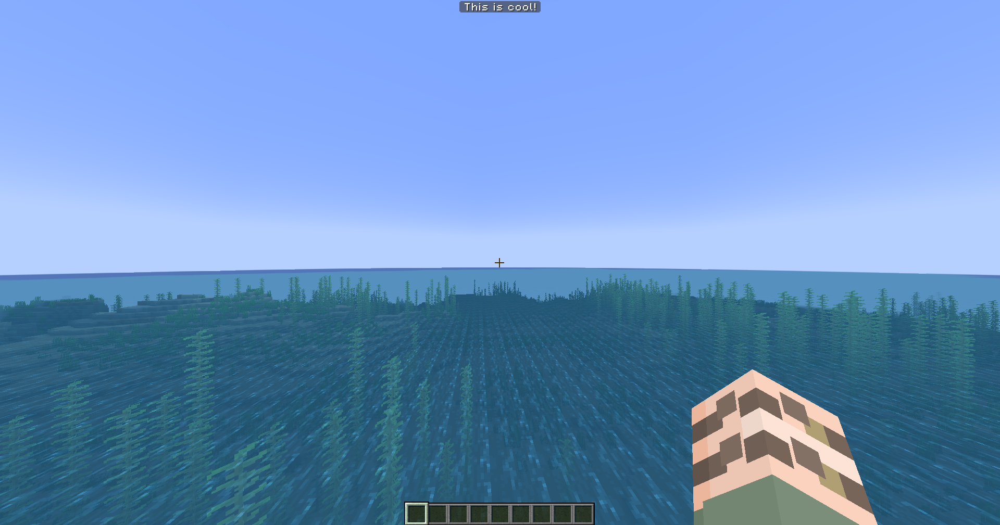

# PlayerBossbar
A custom Bossbar with a cool look that changes depending on the text

## Overview
Using a resourcepack to add custom images and negative space font.
The code creates the right string of text to use in the title of the bossbar.

## Usage
Currently the characters allowed to be used in the bossbar title are *abcdefghijklmnopqrstuvwxyzABCDEFGHIJKLMNOPQRSTUVWXYZ1234567890:| !?*

To add you're own character you first need to count how many pixels in width the character is.
Then you need to add the character to the list of allowed characters in the *PlayerBossBar* class.
Afer that you need to add the character depending on the amount of pixels in width to the right place in the *getCharactersPerLetter* method.

Everyone is allowed to use the code and the resourcepack in you're own projects. Credits are not needed but would be appreciated.
